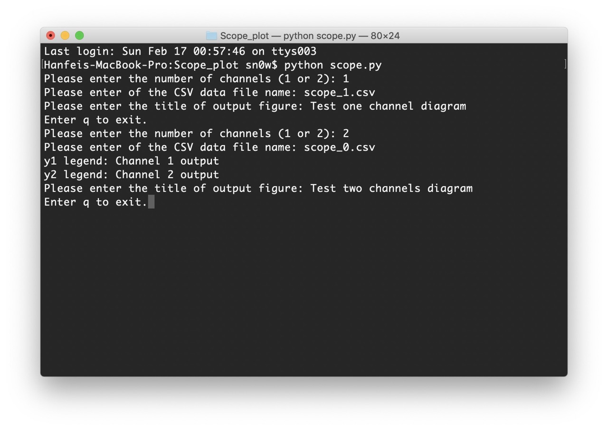

# Scope_plot

This program import oscilloscope readings from CSV file. You can choose whether 1 or 2 channels readings at the start of program.

## Use

1. Put oscilloscope CSV file in the same directory of scipt.
2. Open Terminal (or other Python environment) at the same folder.
3. Run `python scope.py`

## Running example

Example CSV file:

- "scope_0.csv" for a common 2 channel output
- "scope_1.csv" for an 1 channel output

Terminal input and output:

Image generated:

- One channel output

- Two Channel output (Coloured)

(Muon coincidence event observed using 2 photomultiplier tubes)